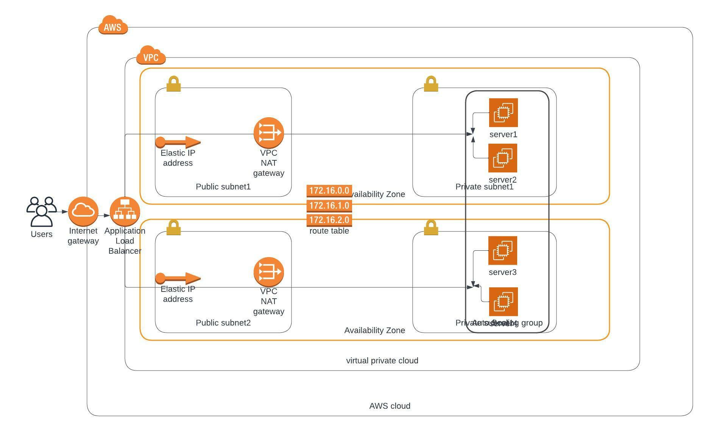

# Deployment of a high-availability web app using CloudFormation

This projects uses CloudFormation script to deploy a VPC with associated subnets and web application. There are two script, One for the the network infrastructure required to run the application:
`udagram-network-chuks.yml` and the other is for the server deployment: `udagram-servers-chuks.yml`

## Here is the Infrastructural Diagram for System



I used a Launch Configuration to deploy four webservers, 2 located in each of the private subnets. The launch configuration is used by an autoscaling group.

## Deployment Script

### To create the stack

To create the stack using CloudFormation, run the create bash script with the following command

```
./create.sh <stack-name> <template-body>.yml <parameters>.json <aws-profile-name>
```

Example:

```
./create.sh chuksudagramproject2 udagram-network-chuks.yml udagram-network-params.json devOps-admin
```

### To update the stack

To update the stack using CloudFormation, run the update bash script with the following command

```
./update.sh <stack-name> <template-body>.yml <parameters>.json <aws-profile-name>
```

Example:

```
./update.sh chuksudagramproject2 udagram-network-chuks.yml udagram-network-params.json devOps-admin
```

### To Delete a stack

To Delete the stack using CloudFormation, run the delete bash script with the following command

```
./delete.sh <stack-name> <aws-profile-name>
```

Example:

```
./update.sh chuksudagramproject2 devOps-admin
```

### Loadbalancer URL

`http://.chuks-WebAp-RPQ39UD2PJTH-1950042889.us-east-1.elb.amazonaws.com`
